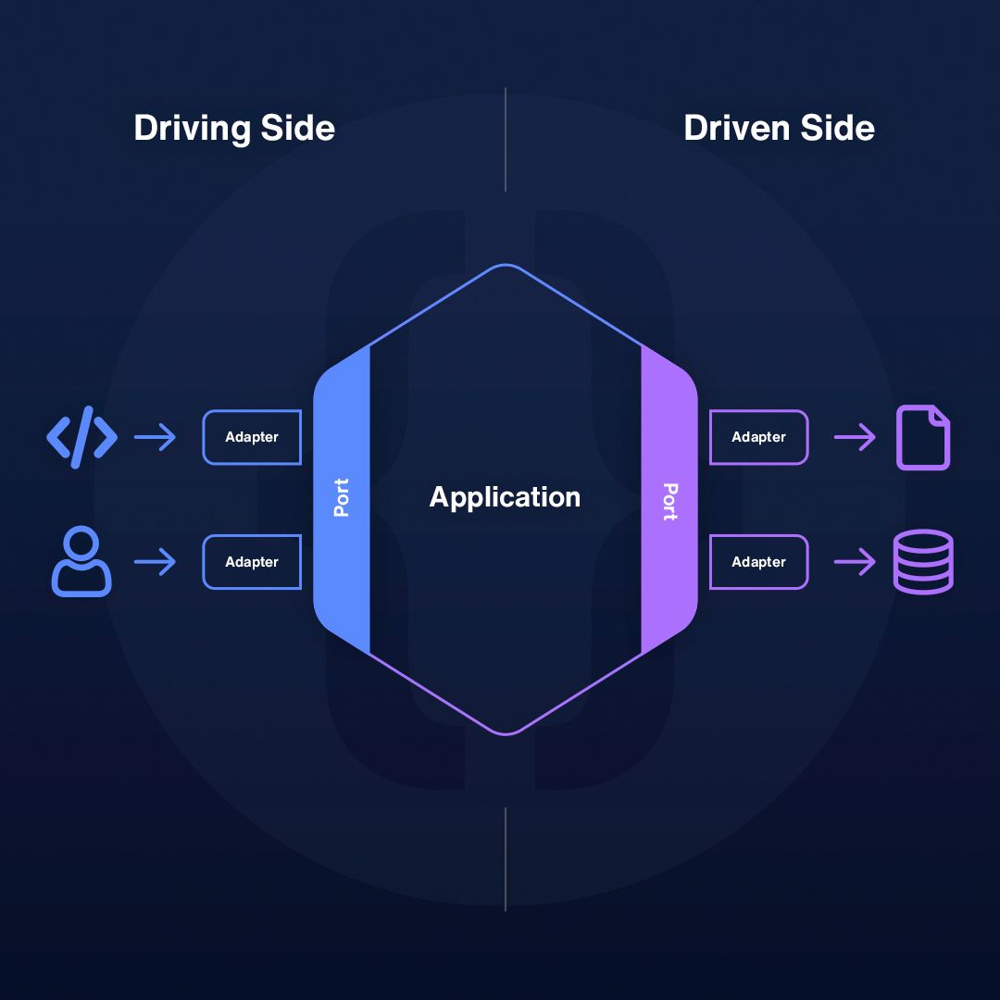

# Engineering notes: Software Architecture Implementation

Reference on how Clean Architecture is implemented for This Project.

> _How is the codebase organized? It implements the Hexagonal Architecture software pattern to structure the application._

## What is `Hexagonal Architecture`?

- A software architecture pattern designed to build applications where each component or layer is loosely coupled.

- Why? Because this architecture promotes separation of concerns, allowing us to design business logic in a way that remains unaffected by the external environment.

- When we keep our core logic isolated, we gain the flexibility to integrate other tools or technologies that can interact with it without requiring any changes to the core itself.

- For example, if the core logic is written in pure vanilla JavaScript, we gain the flexibility to use any framework on top of it such as Express, NestJS, or Fastify without needing to modify the core, And it’s not limited to frameworks we can also switch between different databases such as MongoDB, PostgreSQL, etc. within the same codebase while still preserving the integrity of the core.

Refer to the diagram below



- How do they interact? In Hexagonal Architecture, we have Ports and Adapters. For example, the core logic will define a port that accepts storage connections. This allows external entities to interact with the core by plugging in different storage adapters, such as a MongoDB adapter, PostgreSQL adapter, or any other type of database. This way, the core logic remains isolated, and we can easily swap the external storage without changing the business logic.

## Adoption of Hexagonal Architecture in This Project

I basically have 3 Main Modules Namely **Core Module**, **Bindings Module** & **Infrastructure Module**

### Core Module

This module contains the core logic of the application, including the definition of entities, their relationships, and all the business rules.

**Directory Layout**

```bash
/src/core
├── business ## Core Business Logic
│   ├── EntityManager.ts
│   └── RulesEngine.ts
│   ...
│
├── applications # These is where all the use cases are defined
│   ├── CreateUser.ts
│   ├── UpdateUser.ts
│   ├── CreateInsight.ts
│    ...
│
├── interfaces # These are the Ports which are implemented by adapters in order to communicate with the core module
│   └── storageInterface
│       ├── InsertDocument.ts
│       ...
│
├── common # Contains files that is been used internally with code module e.g. constants, utils etc...
│   ├──
    ...

```

### Bindings Module

The Bindings module acts as an adapters layer, containing various external implementations that interact with the core business logic.

**Directory Layout**

```bash
/src/bindings
├── inbound  # External communication (requests) to core logic
│   ├── routes
│   │   ├── user
│   │   │   ├── createUserRoute.ts
│   │   │   ...
│   │   └── insight
│   │       ├── createInsightRoute.ts
│   │       ...
│   │
│   ├── controllers
│   │   ├── createUserController.ts
│   │   ├── updateUserController.ts
│   │   ├── getUserController.ts
│   │   ├── createInsightController.ts
│   │   └── updateInsightController.ts
│   │   ...
│   │
│   ├── middlewares
│   │   ├── authMiddleware.ts
│   │   ...
│   │
│   ├── schemas  # ZOD Validations
│   │   ├── userSchema.ts
│   │   ...
│
├── outbound  # External systems (databases, etc.) interacting with core logic
│   ├── storage
│   │   ├── mongoDB
│   │   │   ├── insertDocumentStorage.ts
│   │   │   ...
│
├── common  # Common utility files
│   ├── utils.ts
│   └── types.d.ts
    ...


```

### Infrastructure Module

The Infrastructure Module contains configuration files and external service clients that handle interactions with external systems and resources.

**Directory Layout**

```bash
/src/infrastructure
├── config  # Configuration files (if any)
│   ├── config.ts
│   ...
│
├── clients  # External clients for services (e.g., databases, caching)
│   ├── mongodbClient.ts
│   ...

```

## How the Request Flow Works

- Client sends an HTTP request to `POST /insights`
- Router forwards the request to the appropriate controller (insight.controller.ts).
- Controller extracts and validates data (rejects invalid input immediately).
- Controller calls the CreateInsight use case (src/core/business/applications.ts).
- Use case enforces business rules (validates title, checks rate limits, etc.).
- Use case calls the repository port (/src/core/interface) to save the insight.
- Outbound adapter (i.e storage) saves the insight in the database.
- Use case returns the saved insight to the controller.
- Controller sends a `201 Created` response back to the client.
